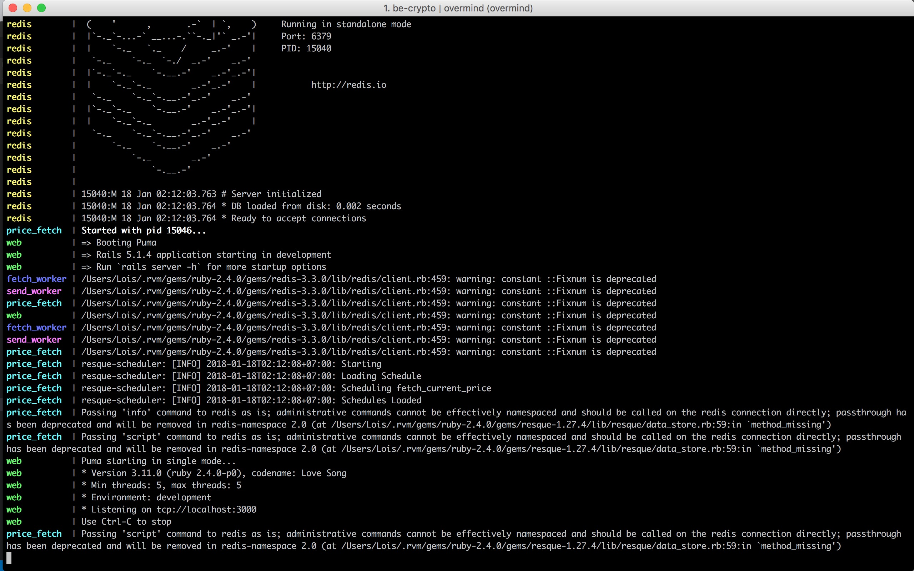
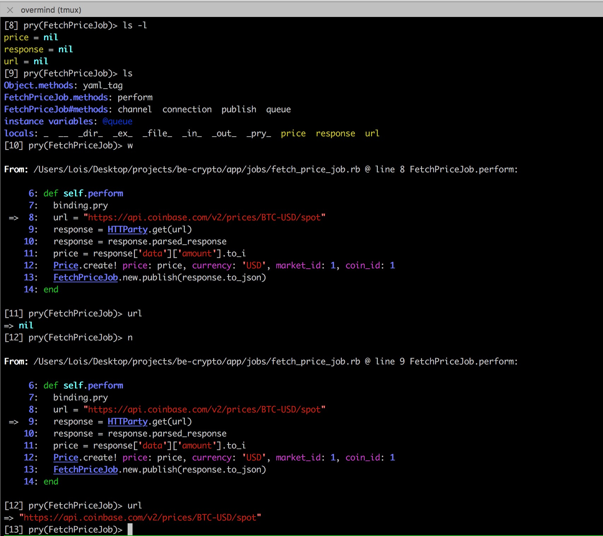
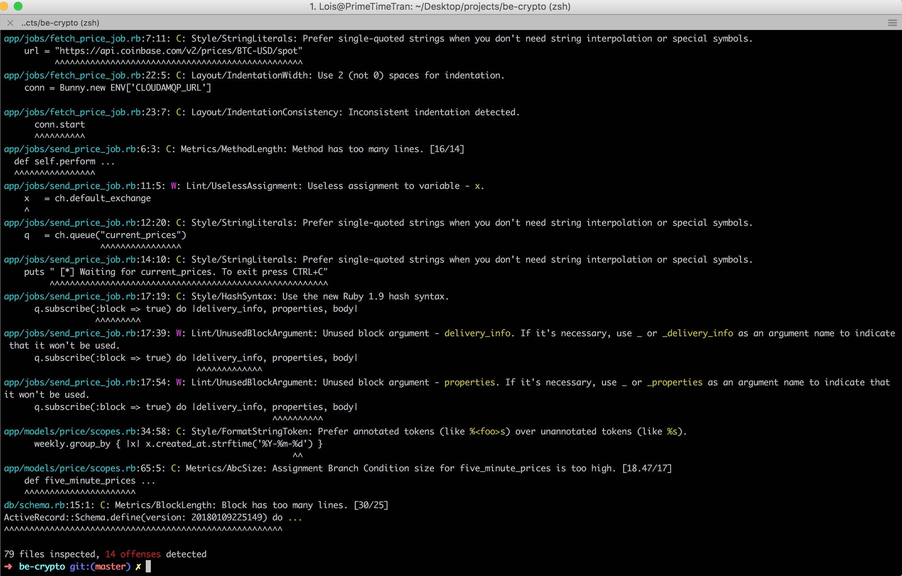

# CryptoRails Backend
Versioning information provided below. Please ensure that you have the correct versions of these dependencies installed before proceeding.

- `ruby 2.4.0`
- `rails 5.1.4`
- `postgres 10.1`
- `CloudAMPQ` environment key. Ask your team lead for it. The .env sample is merely that, a sample. The key is does not work and you will not be able to access the CLOUDAMQP cluster using it.
-  [Overmind](https://github.com/DarthSim/overmind) for process management

## CryptoRails Backend Setup Instructions
Hopefully, following the instructions below will get you up in running if you've got the necessary depenedcies hooked up. Don't hesitate to ask for support on getting your development environment up and running though. We understand it can be difficult depending on your environment.

##### Clone the repo:
    git clone https://github.com/PrimeTimeTran/cryptorails

There's a `.ruby-version` file here, RVM should set your environment to use `ruby 2.4.0`. Confirm by running `ruby -v` after you've cloned the repo and `cd` into it.

##### Install Ruby Dependencies
    bundle install

At the time of this writing, Redis 3.3.0 is required due to a [bug with Redis 4.0](https://github.com/rails/rails/issues/30527). If you get errors complaining about current version then you can run `bundle update redis` which will force the version specified in the gemfile to install, **3.3.0**

##### Run the process manager(we like Overmind)
    overmind s

This is the process manager we use. You can learn more about why we prefer it by reviewing this [guide](https://evilmartians.com/chronicles/introducing-overmind-and-hivemind). If you take a peek at the Procfile located in the root directory, you'll see that Overmind will manage starting both Rails & Redis servers, required workers for grabbing & sending data related to pricing, as well as a a resque scheduler which fetches data from the Coinbase API at designated intervals.

# Completion
At this point, you should see a screen that looks something like this.

On the left, Overmind lists which processes logs you're seeing. We define the processes required for running our app, Redis, price_fetch, web, fetch_worker, send_worker, etc in `Procfile`, which is the file executed when we run `overmind s`.

## Tips & tricks

### Debugging
Included in the repo is a .pryrc file. If you're new to using pry we highly recommend you [review the documentation](https://github.com/pry/pry) because it's an amazing tool. It'll make debugging much easier once you familiarize yourself with it.

You can view local variables with `ls -l`, instance & class methods with `ls`, view exactly where you stopped execution with `w`, and step through execution one line at a time with `n`.

Make sure you read the documentation beause this is just the beginning of the power of `pry`.

 ### Code Review
 Rubocop is also included in the Gemfile. Rubocop will make you a better programmer, **period**.

 Once you've done your work, run `rubocop` and Rubocop will list for you warnings of offenses commited. By reading the complaints Rubocop specifies and correcting, you'll improve your coding skills. [Bbatsov](https://github.com/bbatsov/ruby-style-guide) is the Ruby style guide used by Rubocop. Make sure you read the complaints carefully because they'll teach you a lot.

 Once you've made the corrections to the specified by Rubocop, add the changes & commit. With the help of Rubocop, you'll learn more about the nuances of Ruby as well as catch simple mistakes before they're pointed out in code review.

 